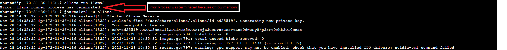

# NEXT.JS Accessibility

## next.config.js Options

NEXT.JS can be configured through a next.config.js file in the root of your project directory (for example, by package.json).

>next.config.js

``` TypeScript
/** @type {import('next').NextConfig} */
const nextConfig = {
  /* config options here */
}

module.exports = nextConfig
```

`next.config.js` is a regular Node.js module, not a JSON file. It gets used by the NEXT.JS server and build phases, and it's not included in the browser build.

Reference: [NEXT.JS Accessibility Documentation](https://nextjs.org/docs/app/api-reference/next-config-js)

## NEXT.JS Guidelines for better web accessibility in our forms

Reference: [NEXT.JS Accessibility Article](https://nextjs.org/learn/dashboard-app/improving-accessibility)

## Data Science

### Ollama Integration

#### Overview

This is the documentation of the process and resources used for integrating and working with Ollama to run Large Language Models (LLMs) locally.

#### Llama 2 Development on AWS

Today, we focused on the deployment of Llama 2 on AWS. We explored various AWS services and how they can be utilized for efficient deployment and scaling. Key resources:

1. **SageMaker Notebook Example**: A comprehensive guide on deploying Llama 2 with AWS SageMaker.
   [View Notebook](https://llama-2-deployment-bhaw.notebook.eu-north-1.sagemaker.aws/examples/preview?example_id=%2Fhome%2Fec2-user%2Fsample-notebooks%2Fintroduction_to_amazon_algorithms%2Fjumpstart-foundation-models%2Fllama-2-text-completion.ipynb)
2. **Lambda Function Implementation**: Review of the Lambda function for Llama 2 deployment.
   [GitHub Repository](https://github.com/AIAnytime/Llama-2-Deployment-on-AWS/blob/bdec1d69738706c9a6c420cd05260fd486ab7663/lambda_function.py)
3. **Sagemaker API Implementation with Ollama**: Tutorial to integrate Sagemaker API.
   [Sagemaker API Tutorial] (<https://www.youtube.com/watch?v=3y_TcDNC0HE>)

#### Issues and Documentation in Llama 2 Deployment

Focused on resolving issues and enhancing documentation for Llama 2. Key highlights:

1. **Ollama2 Documentation**: Updated the API documentation for better clarity and usability.
   [API Documentation](https://github.com/jmorganca/ollama/blob/main/docs/api.md)
2. **Issues with Ollama2 on AWS EC2**: Investigated and documented solutions for running Ollama2 on AWS EC2.
   [GitHub Issue #630](https://github.com/jmorganca/ollama/issues/630)
   [GitHub Issue #788](https://github.com/jmorganca/ollama/issues/788)

On to finding alternate solutions for implementing Ollama2 with the SpringBoot Java Backend.

Looking more into different ways of integrating Ollama2 with the Accessibilator.

#### Llama2 Implementation and Hugging Face Models

Today's focus was on Llama2 implementation and integrating Hugging Face models with AWS SageMaker. Key aspects:

1. **Llama2 using Java**: Explored the Java implementation of Llama2 for diverse application scenarios.
   [Llama2 Java Repository](https://github.com/mukel/llama2.java)
2. **Ollama2 Implementation using LangChain and Python**: Analyzed the use of LangChain with Python for Ollama2.
   [YouTube Tutorial](https://www.youtube.com/watch?v=CPgp8MhmGVY)
3. **Hugging Face Models on AWS SageMaker**: Discussed challenges and solutions for training Hugging Face models on SageMaker.
   [Hugging Face Discussion](https://discuss.huggingface.co/t/some-issues-when-training-model-on-sagemaker/12213)
4. **Langchain Documentation - Implementation of Ollama with Python**: Alternate implementation of Ollama APIs using Python language.
   [Ollama with Python using Langchain](https://python.langchain.com/docs/integrations/llms/ollama)

### Implementation and issues documentation

#### 1st Solution

AWS EC2 server instance with type as **t3.micro** has very low resources to accommodate the llama2 model from Ollama2.

Reason: The system memory on the EC2 machine is full and there's no space for the llama runner process to be initialized.

#### 2nd Solution

We tried implementing Ollama on AWS Sagemaker but the free tier machine of the size **ml.t3.medium** doesn't allow us to host the Llama2 model.

#### 3rd Solution

##### Implementation of Ollama APIs using Langchain in Python

Again, hosting Ollama on a server for the Python package `Langchain` to communicate with Ollama's APIs was a necessary factor. This ultimately again proved as a roadblock for us.

#### 4th Solution - Expert advise

##### Using AWS EC2 with higher computational resources

##### Observations

Implementation on machines with higher amount of resources was possible and we were able to observe positive results from the integration.
This proved that Ollama cannot be hosted on VMs with low system memory (RAM).

The AWS EC2 with instance type as `t3.xlarge` (4 vCPUs | 16 GiB RAM) was capable of running the llama2 models from the Ollama integration. The Ollama API was responding while the instance was running properly.
The new issue that we faced was the amount of time (latency) it took for the API to respond, for even a simple prompt, was approximately 15 to 20 minutes.

We created a new machine with higher resources and instance type as `t3.2xlarge` (8 vCPUs | 32 GiB RAM). The results were observed to be the same, which proved that the system memory was only linked to loading the model onto the machine but executing the prompts still took additional computational resources.

This issue was discussed with a Cloud expert and we concluded that since the technology is computationally exhaustive with regards to the resources, investing money into the Cloud services for a machine with higher amount of resources is the only way around this problem.

##### Recordings

- AWS EC2 Large instance of type `t3.xlarge` with 16 GiB RAM and 4 vCPUs and the integration of Ollama onto the EC2 machines with successful execution.
- Check `EC2-Large-Instance-Ollama-Run-Check-1.mp4` to `EC2-Large-Instance-Ollama-Run-Check-7.mp4` for implementation videos on step-by-step EC2 commands for running Ollama.

<https://github.com/dayang4321/MSc-Team-Project-CMPU9010-2023-24-Group-3/assets/50550566/06c87c37-606f-4529-aea9-afd8777059b8>

<https://github.com/dayang4321/MSc-Team-Project-CMPU9010-2023-24-Group-3/assets/50550566/78039ec8-9831-49a7-9e61-7784ab9e9e72>

<https://github.com/dayang4321/MSc-Team-Project-CMPU9010-2023-24-Group-3/assets/50550566/36434557-90e0-4323-a842-0b261147f798>

<https://github.com/dayang4321/MSc-Team-Project-CMPU9010-2023-24-Group-3/assets/50550566/aa4b0440-9e29-4954-8e71-50e7e4e71623>

<https://github.com/dayang4321/MSc-Team-Project-CMPU9010-2023-24-Group-3/assets/50550566/f44890cf-87bb-463d-87e3-a7f7d7ec6880>

<https://github.com/dayang4321/MSc-Team-Project-CMPU9010-2023-24-Group-3/assets/50550566/b9f1633e-ebae-4fed-9688-61f241b941ea>

<https://github.com/dayang4321/MSc-Team-Project-CMPU9010-2023-24-Group-3/assets/50550566/1f5ace3e-9f55-4ae1-8a22-e3dd1b7d4e0e>

### Key Resources

- **Ollama meets Langchain**: [YouTube Video](https://www.youtube.com/watch?v=k_1pOF1mj8k)
- **Ollama Installation Guide on Linux**: [GitHub Guide](https://github.com/jmorganca/ollama/blob/main/docs/linux.md)
- **Ollama Documentation**: [GitHub Repository](https://github.com/jmorganca/ollama/tree/main/docs)
- **Articles for Setting Up Ollama**: [Medium Article](https://medium.com/@robjsliwa_71070/easy-as-ollama-running-large-language-models-locally-with-a-elegant-web-ui-af3255b18141)

### Reference Materials

- **Deploy LLMs Into Production At NO COST!**: [YouTube Video](https://www.youtube.com/watch?v=6CRrhxpF8WI)
- **Using Ollama to Host LLMs**: [Medium Article](https://medium.com/@mnghamaty/using-ollama-to-self-host-llms-0b8e4563c697)
- **Ollama - Self-Hosted AI Chat in Docker**: [Noted.lol Article](https://noted.lol/ollama/)

## Alternate Solutions

### Using SpringBoot Package to Integrate Ollama

- **SpringBoot AI API Documentation**: [SpringBoot AI API](https://docs.spring.io/spring-ai/reference/api/aiclient.html)
- **SpringBoot Package pom.xml**: [GitHub pom.xml](https://github.com/spring-projects/spring-ai/blob/main/pom.xml)

### Using vllm Package within Python

- **Issues with vllm Package**: [GitHub Issue](https://github.com/vllm-project/vllm/issues/451)
- **LLM Text Generation with vLLM on Windows 11**: [Medium Article](https://betterprogramming.pub/superfast-llm-text-generation-with-vllm-on-windows-11-4a6617d4e0b3)

### Hosting Windows laptop as a standalone server

- **Setting up a server using a personal Windows laptop**: [Windows laptop as a server] (<https://medium.com/@amaanlari5/how-to-access-your-localhost-from-mobile-windows-and-macos-7cb7bdb4aa4f>)
